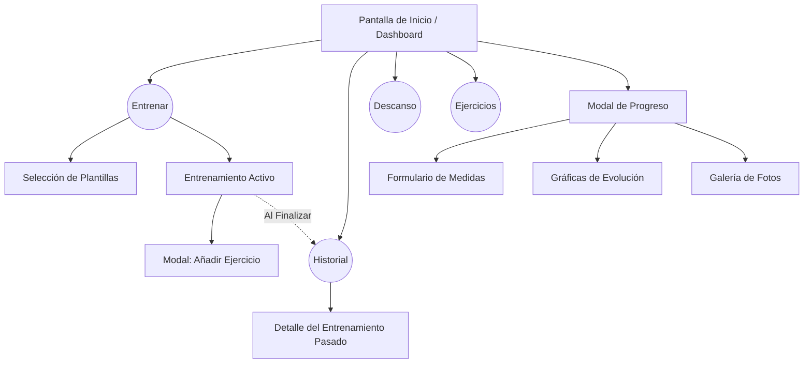

# FitApp: Seguimiento y Entrenamiento

## Introducción

Bienvenido a la aplicación de entrenamiento definitiva construida con React Native y Expo. Esta aplicación está diseñada para ayudarte a llevar un control estructurado de tus rutinas en el gimnasio, hacer un seguimiento detallado de tus ejercicios, tiempos de descanso y evolución física de manera intuitiva y rápida. 

Gracias a su arquitectura moderna, permite gestionar entrenamientos libres o utilizar plantillas predefinidas (Rutinas Push, Pull, Piernas, etc.), además de mantener un historial de tu rendimiento y fotografías de progreso corporal.

---

## Capturas de la app

*(Nota: Agrega aquí las capturas de pantalla de la aplicación)*

- [Captura de Pantalla Inicio]
- [Captura de Pantalla Entrenar]
- [Captura de Pantalla Historial]
- [Captura de Pantalla Ejercicios]
- [Captura de Pantalla Progreso y Gráficas]

---

## Explicación del funcionamiento

La aplicación está diseñada para que el registro de tus entrenamientos sea lo más ágil posible. Sus principales módulos de funcionamiento incluyen:

1. **Dashboard Central (Inicio):** Una vista que centraliza tu actividad. Muestra si tienes un entrenamiento activo, el resumen de tu última sesión, accesos directos al temporizador, tu catálogo de ejercicios y tu progreso corporal.
2. **Sistema de Entrenamiento:** 
   - **Plantillas vs Libre:** Puedes iniciar un entrenamiento desde cero o utilizar una de las 5 plantillas precargadas con ejercicios ya definidos.
   - **Registro en tiempo real:** Agrega peso y repeticiones a cada serie, márcalas como completadas y observa el tiempo transcurrido en tu sesión.
3. **Biblioteca de Ejercicios:** Un catálogo completo con datos reales de ejercicios divididos por grupo muscular, incluyendo descripción, músculos implicados, nivel y beneficios.
4. **Seguimiento Físico (Progreso):** Un módulo específico que te permite registrar tu peso corporal y medidas de manera periódica, visualizando tu evolución a través de gráficas interactivas y guardando un diario fotográfico local.
5. **Persistencia de Datos:** Todos los datos (historial, rutinas activas, registros corporales) se almacenan localmente utilizando `AsyncStorage`, lo que garantiza que tu información permanezca segura en tu dispositivo.

---

## Diagrama de la aplicación (pantallas y flujo)

El flujo de navegación principal está basado en un sistema de pestañas (Bottom Tabs) que conecta las 4 vistas principales, más el modal de Progreso y los detalles del historial.

---

## Conclusión
## Conclusión Carlos Andrei Saucedo Aguilar
Esta aplicación es bastante sencilla de utilizar, la probamos en el gym para probar el funcionamiento y aunque si hay detalles que pulir creo que cumple con su cometido, es bastante rapida, ligera y cumple con todas las funciones que se requieren para llevar un control de rutinas y progreso de manera basica pero funcional. Los puntos fuertes son el temporizador integrado y las graficas para ver el progreso. Finalmente creo que es una buena base para partir del desarrollo de una aplicacion mas robusta y personalizable con el usuario

## Conclusión Erick Zaid Medina Torres
Google Antigravity te hace sentir como dios al momento de desarrollar ya que piensas en algo se lo dices y en menos de 1 minuto tienes 4 archivos nuevos y más de 300 líneas de código en cada uno, sin embargo, es importante recalcar que es abbsolutamente necesario trabajar por capas para elaborar un programa más apegado a la realidad ya que como menciona en la práctica, si le pides todo del tirón el agente sobrepiensa, alucina y hace tonterías. PD: Pues saquen unas aplicaciones para empezar a monetizar ¿no?
